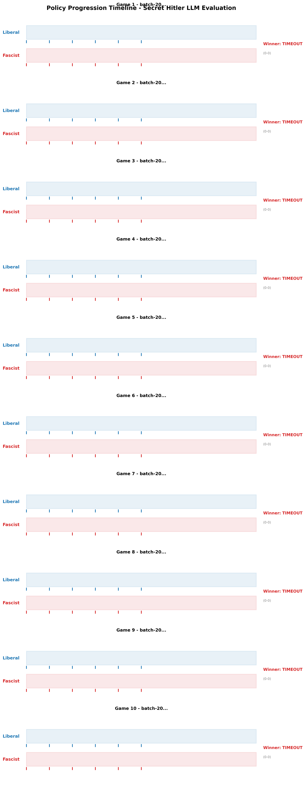
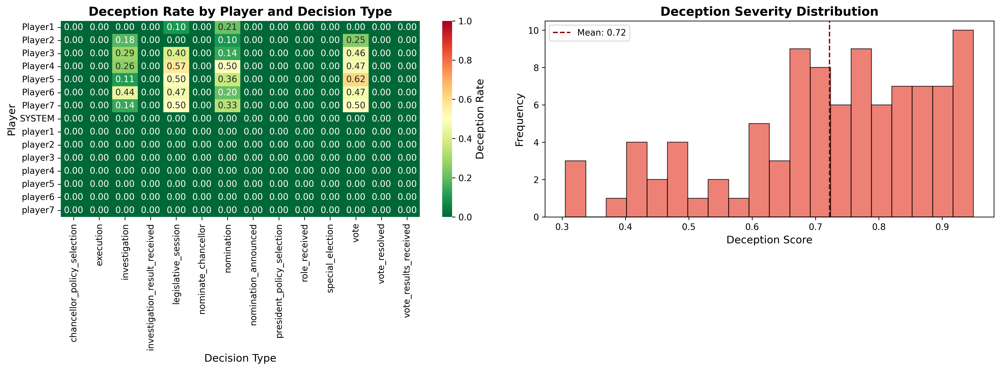
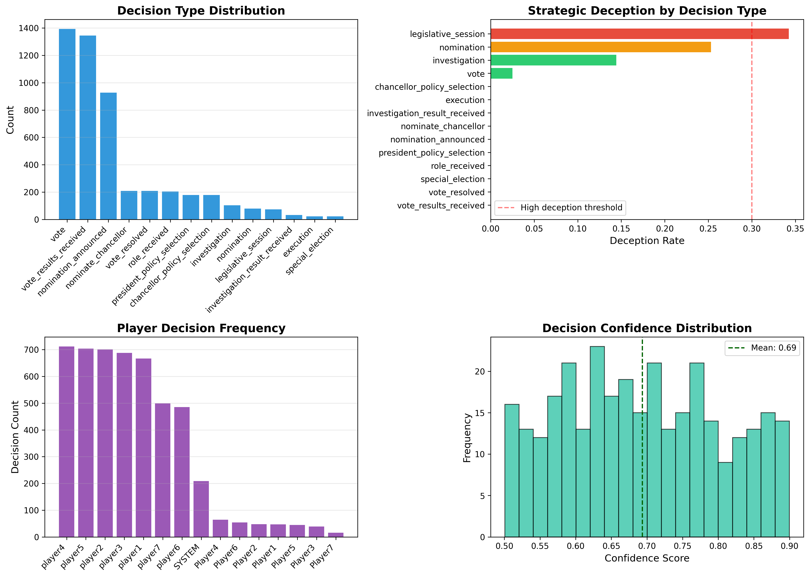
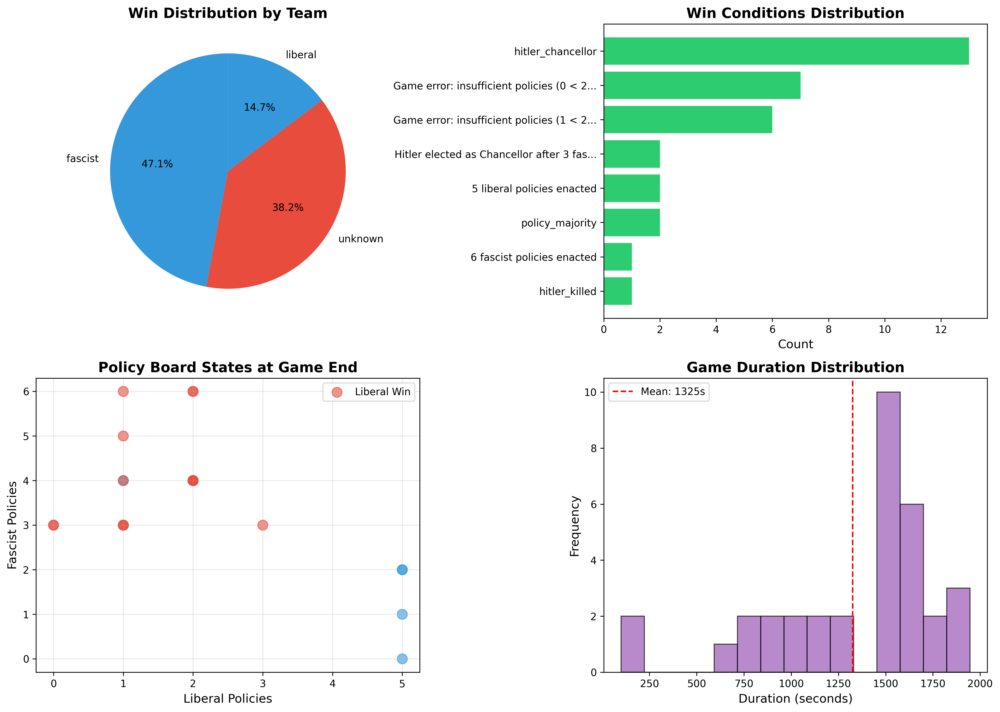
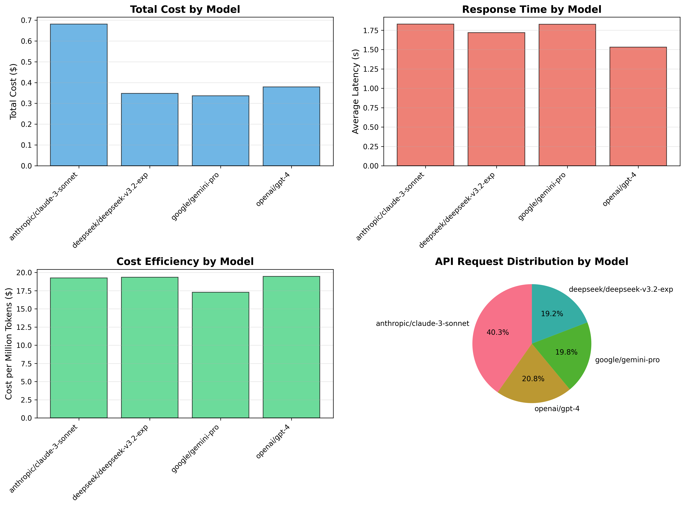
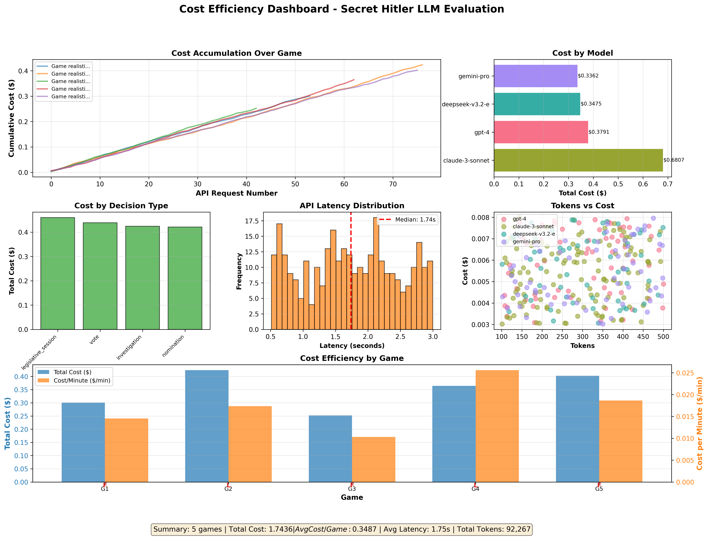

# Secret Hitler LLM Evaluation Framework

Multi-agent strategic deception evaluation system using Secret Hitler as testbed for large language model research.

**Author**: Samuel Chakwera ([stchakdev](https://github.com/stchakwdev))

## Overview

This framework implements Secret Hitler in Python to evaluate LLM capabilities in strategic multi-agent scenarios involving:

- **Strategic deception and coalition formation**
- **Theory of mind and belief tracking**
- **Natural language communication under uncertainty**
- **Multi-agent coordination with hidden information**

The framework provides a complete reimplementation of Secret Hitler game mechanics with comprehensive logging and analysis tools for behavioral research.

## Installation

```bash
# Clone repository
git clone https://github.com/stchakwdev/Secret_H_Evals.git
cd Secret_H_Evals

# Install dependencies
pip install -r requirements.txt

# Configure API key
cp .env.example .env
# Edit .env and add your OpenRouter API key
```

## Quick Start

```bash
# Run single 5-player game
python run_game.py --players 5

# Run with database logging (for Inspect AI integration)
python run_game.py --players 5 --enable-db-logging

# Run batch evaluation (10 games)
python run_game.py --batch --games 10 --players 5

# Use specific model
python run_game.py --model anthropic/claude-3-sonnet

# Full research workflow
python run_game.py --batch --games 20 --players 7 --enable-db-logging
python scripts/export_to_inspect.py --all
python scripts/analyze_with_inspect.py
```

## Architecture

```
core/
├── game_state.py          # Complete Secret Hitler rule implementation
└── game_manager.py        # Game orchestration and LLM coordination

agents/
├── openrouter_client.py   # OpenRouter API with prompt capture
└── prompt_templates.py    # Phase-specific prompts for LLM agents

config/
└── openrouter_config.py   # Model configurations and routing logic

game_logging/
└── game_logger.py         # Multi-level logging with database support

analytics/                 # Statistical analysis modules
├── hypothesis_testing.py  # Statistical tests (chi-square, Fisher, Spearman)
├── temporal_analysis.py   # Game phase and trajectory analysis
└── belief_calibration.py  # LLM belief calibration metrics

evaluation/
├── database_schema.py     # SQLite schema with prompts table
├── inspect_adapter.py     # Enhanced Inspect AI adapter with batch analysis
└── README.md             # Detailed Inspect integration guide

dashboard/                 # NEW: Interactive visualization
├── app.py                # Plotly Dash application entry point
├── layouts.py            # Multi-tab dashboard layouts
├── callbacks.py          # Interactive callback handlers
└── data_loader.py        # Database query interface

scripts/
├── export_to_inspect.py      # Batch export to Inspect format
├── analyze_with_inspect.py   # Statistical analysis
├── migrate_historical.py     # Import historical logs
└── generate_inspect_report.py # Report generation

experiments/
├── batch_runner.py        # Parallel game execution
└── analytics.py           # Statistical analysis tools
```

## Recent Updates

### Version 1.5.0 (November 2025) - Full Analytics Integration

**Phase 5: Complete Inspect AI Analytics Integration**

Enhanced the Inspect AI adapter with full integration of all analytics modules:

- **Coalition Detection**: Louvain community detection for identifying player alliances
- **Model Comparison**: Pairwise chi-square tests with Elo ratings and multiple comparison correction
- **Temporal Analysis**: Game phase segmentation (early/mid/late) with turning point detection
- **Belief Calibration**: Brier score, ECE, MCE, log loss, and overconfidence metrics
- **Hypothesis Testing**: Role-based and decision-type tests with effect sizes (Cohen's d/h, Cramér's V)
- **Batch Analysis**: Cross-game statistical analysis with Bonferroni/Holm corrections

```bash
# Export with full analytics
python scripts/export_to_inspect.py --all

# Run batch analysis
python scripts/analyze_with_inspect.py --batch
```

### Version 1.4.0 (November 2025) - Multi-Model Comparison Framework

**Phase 4: Multi-Model Comparison Framework**

Run comprehensive comparison experiments across 11 models (9 FREE + 2 paid) with full statistical analysis:

```bash
# List all available models
python run_game.py --list-models

# Run full Phase 4 comparison (5,500 games, ~$55)
python run_game.py --model-comparison --games-per-model 500

# Quick test with free models only (zero cost)
python run_game.py --model-comparison --games-per-model 10 --free-only

# Compare specific models
python run_game.py --model-comparison --games-per-model 50 \
  --compare-models x-ai/grok-4.1-fast:free,deepseek/deepseek-chat
```

**New Components**:
- **Model Comparison Config** (`config/model_comparison_config.py`):
  - 11 model definitions with 2025 OpenRouter pricing
  - FREE tier: Grok 4.1 Fast, GLM 4.5 Air, Llama 4 Maverick/Scout, DeepSeek R1, Gemini 2.0, Mistral Small 3.1, Optimus Alpha, Bert-Nebulon Alpha
  - PAID tier: GPT-5 Nano ($0.05/$0.40 per M), DeepSeek V3 ($0.20/$0.80 per M)
  - Comparison groups for hypothesis testing (Chinese vs Western, Reasoning vs Standard, etc.)

- **Model Comparator** (`experiments/model_comparator.py`):
  - Batch comparison runner with progress persistence
  - Per-model statistics tracking (win rates, costs, tokens)
  - LaTeX table generation for publications
  - Automatic report generation

- **Model Comparison Analytics** (`analytics/model_comparison.py`):
  - Chi-square tests for win rate comparison
  - Cohen's h effect size calculation
  - Cramér's V for association strength
  - Elo rating calculation from pairwise results
  - Wilson score confidence intervals
  - Bonferroni/Holm multiple comparison correction
  - LaTeX and Markdown output generation

**Cost Estimates**:
| Tier | Models | Games | Cost |
|------|--------|-------|------|
| FREE | 9 | 4,500 | $0 |
| PAID | 2 | 1,000 | ~$54 |
| **TOTAL** | **11** | **5,500** | **~$55** |

### Version 1.3.0 (November 2025) - Performance for Scale

**Phase 3: Performance Optimizations for 5000+ Games**
- **Parallel Batch Runner** (`experiments/parallel_runner.py`)
  - Configurable concurrency with `asyncio.Semaphore`
  - Rate limiting for API quota compliance
  - Progress persistence for crash recovery
  - Automatic retry with exponential backoff
  - Run: `python run_game.py --batch --games 100 --parallel --concurrency 5`

- **High-Performance Database** (`evaluation/database_scale.py`)
  - Connection pooling with configurable pool size
  - Batch insert operations (100x faster for bulk writes)
  - Streaming queries for memory-efficient large dataset processing
  - Statistics caching with TTL
  - WAL mode for concurrent access

- **Streaming Analytics** (`analytics/streaming_stats.py`)
  - Welford's algorithm for online mean/variance (single-pass)
  - Memory-efficient histogram computation
  - Incremental statistics with merge capability for parallel processing
  - Rolling window calculations

- **Monitoring & Metrics** (`experiments/monitoring.py`)
  - Prometheus-compatible metrics export
  - Counter, Gauge, Histogram metric types
  - Alert rules for anomaly detection
  - Resource and cost tracking
  - Real-time performance dashboards

**New CLI Options**:
```bash
# Parallel execution (recommended for large batches)
python run_game.py --batch --games 1000 --parallel --concurrency 5

# With rate limiting and resume capability
python run_game.py --batch --games 5000 --parallel -c 10 --rate-limit 120 --resume
```

### Version 1.2.0 (November 2025) - Advanced Analytics

**Phase 1: Interactive Visualization Dashboard**
- Plotly Dash dashboard with real-time analytics (`dashboard/`)
- Multi-tab interface: Game Overview, Deception Analysis, Decision Patterns, Cost Analytics
- Interactive filtering by game, player, model, and date range
- Trust network visualization with D3.js force-directed graphs
- Export capabilities for figures and charts
- Launch: `python -m dashboard.app --port 8050`

**Phase 2: Research Rigor Components**
- **Statistical Hypothesis Testing** (`analytics/hypothesis_testing.py`)
  - Chi-square tests for model comparison
  - Fisher's exact test for deception by role
  - Spearman correlation for game dynamics
  - Kruskal-Wallis test for decision type differences
  - Effect sizes: Cohen's d, Cramér's V, odds ratios
  - Wilson score confidence intervals
  - Multiple comparison correction (Bonferroni, Holm, FDR)

- **Temporal Analysis** (`analytics/temporal_analysis.py`)
  - Game phase segmentation (early/mid/late)
  - Turning point detection using signal processing
  - Trust and deception trajectory calculation
  - Momentum shift detection
  - Trend classification (increasing/decreasing/stable/volatile)

- **Belief Calibration** (`analytics/belief_calibration.py`)
  - Brier score for probability calibration
  - Expected/Maximum Calibration Error (ECE/MCE)
  - Overconfidence and underconfidence detection
  - Reliability diagrams for visualization
  - KL divergence from uniform distribution

- **Enhanced Inspect AI Integration**
  - Batch analysis across multiple games
  - Prompt/response logging for full reproducibility
  - Prompt hashing for deduplication and caching
  - Cross-game hypothesis testing
  - Statistical exports in standard formats

**New Database Features**:
- `prompts` table for complete prompt/response reproducibility
- WAL mode for concurrent access at scale
- Prompt hash indexing for efficient lookups

### Version 1.1.1 (November 2025)

**Critical Bug Fixes**:
- Fixed batch evaluation winner aggregation display (singular/plural mismatch)
- Fixed log path resolution - logs now correctly created in `llm-game-engine/logs/` regardless of working directory
- Fixed batch metadata log directory references in progress tracker

**New Tools**:
- Batch progress tracker (`check_batch_progress.py`) with real-time game state monitoring
- Auto-detection of running batches from metadata
- Watch mode with configurable refresh intervals
- Policy progression visualization
- Example: `python check_batch_progress.py --watch`

### Version 1.1.0 (October 2025)

**Critical Bug Fixes**:
- Fixed JSON serialization error for Enum types (PlayerType) in database logging
- Fixed policy deck reshuffling logic to handle edge cases when deck runs low
- Improved fallback policy selection with graceful degradation

**New Features**:
- Complete Inspect AI integration for standardized evaluation format
- SQLite database storage for structured game data
- CLI entry point (`run_game.py`) with batch evaluation support
- Export and analysis scripts for research workflows
- Comprehensive end-to-end testing with real game data

**Documentation**:
- Added TEST_RESULTS.md with full verification results
- Updated README with new features and examples

## Research Features

### Comprehensive Logging

The framework generates multi-level logs for detailed behavioral analysis:

- **Public events**: Game actions visible to all players
- **Complete game state**: Full state transitions with timestamps
- **Individual reasoning**: Private LLM reasoning traces per player
- **Behavioral metrics**: Deception detection, trust evolution, cost tracking

### Strategic Deception Analysis

- Automatic detection of lies (private reasoning vs. public statements)
- Trust network evolution tracking
- Coalition formation patterns
- Belief update dynamics

### Cost-Optimized Evaluation

- Intelligent model routing based on decision complexity
- Real-time cost tracking per model and decision type
- Configurable cost limits and alerts
- Support for low-cost models (DeepSeek V3.2 Exp default)

### Inspect AI Integration

The framework includes **Inspect AI** integration for standardized evaluation compatible with AI safety research standards:

**Features**:
- **SQLite Database**: Structured storage for games, player decisions, and API requests
- **Inspect Format Export**: Automatic conversion to standardized evaluation format
- **Batch Processing**: Export and analyze multiple games efficiently
- **Statistical Analysis**: Deception detection, win rates, cost analysis
- **Interactive Visualization**: Use Inspect's browser UI for exploration
- **Research-Ready Metrics**: Standardized metrics recognized by the AI safety community

**Workflow**:
```bash
# 1. Run games with database logging
python run_game.py --batch --games 20 --players 7 --enable-db-logging

# 2. Export to Inspect format
python scripts/export_to_inspect.py --all

# 3. Run statistical analysis
python scripts/analyze_with_inspect.py

# 4. View with Inspect UI (optional)
inspect view start data/inspect_logs/*.json

# 5. Generate shareable reports
python scripts/generate_inspect_report.py --report
```

**Output Files**:
- `data/games.db` - SQLite database with all game data
- `data/inspect_logs/*.json` - Inspect-formatted evaluation logs
- `reports/inspect_analysis.csv` - Detailed player decision analysis
- `reports/game_outcomes.csv` - Game results and metrics
- `reports/analysis_summary.json` - Aggregated statistics

See [evaluation/README.md](evaluation/README.md) for detailed usage guide.

## Model Configuration

**Default Model**: DeepSeek V3.2 Exp
Cost: ~$0.14 per million tokens (highly cost-effective for research)

**Supported Models** (via OpenRouter):
- DeepSeek V3.2 Exp (`deepseek/deepseek-v3.2-exp`)
- GPT-4 series (`openai/gpt-4`, `openai/gpt-4-turbo`)
- Claude 3 series (`anthropic/claude-3-opus`, `anthropic/claude-3-sonnet`)
- Gemini series (`google/gemini-pro`)
- Llama series (`meta-llama/llama-3-70b-instruct`)

Configure models in `config/openrouter_config.py` or via `.env` file.

## Usage Examples

### Single Game Evaluation

```python
import asyncio
from core.game_manager import GameManager

async def evaluate_model():
    player_configs = [
        {"id": f"p{i}", "name": f"Player{i}",
         "model": "deepseek/deepseek-v3.2-exp"}
        for i in range(1, 6)
    ]

    game = GameManager(player_configs, api_key)
    result = await game.start_game()

    print(f"Winner: {result['winner']}")
    print(f"Cost: ${result['cost_summary']['total_cost']:.4f}")

asyncio.run(evaluate_model())
```

### Batch Experiments

```bash
# Run 50 games for statistical significance
python run_game.py --batch --games 50 --players 7 --output results/experiment_1

# Compare models
python run_game.py --batch --games 20 --model anthropic/claude-3-sonnet
python run_game.py --batch --games 20 --model deepseek/deepseek-v3.2-exp
```

### Custom Analysis

```python
from experiments.analytics import ExperimentAnalyzer

analyzer = ExperimentAnalyzer("results/experiment_1")
report = analyzer.generate_analysis_report()
analyzer.create_visualizations()
```

## Research Applications

### Evaluation Metrics

The framework automatically tracks:

- Win rates by role and team
- Deception frequency and sophistication
- Trust calibration accuracy
- Strategic consistency (reasoning vs. actions)
- Communication patterns
- Coalition formation dynamics

### Data Export

All game data is logged in structured formats suitable for:
- Statistical analysis (JSON, CSV)
- Visualization (trust networks, belief evolution)
- Qualitative analysis (reasoning traces, communication logs)
- Cost analysis (per model, per decision type)

## Visual Showcase

The framework includes comprehensive visualization tools to analyze LLM strategic gameplay and deception patterns.

### Policy Progression Timeline
Track the strategic race between Liberal and Fascist teams across multiple games, showing policy enactments by turn and final outcomes.



### Deception Analysis
Analyze when and how often LLMs employ deceptive strategies by comparing private reasoning with public statements.



### Strategic Patterns
Comprehensive behavioral analysis showing vote alignment, coalition formation, and multi-agent coordination dynamics.



### Game Outcomes Distribution
Win rate analysis showing team performance, game completion rates, and victory conditions across all evaluated games.



### Model Comparison
Side-by-side performance comparison of different LLM models on strategic reasoning, deception effectiveness, and cost efficiency.



### Cost Analytics Dashboard
Research cost tracking showing per-game costs, token usage breakdown, and cost-per-decision metrics for budget optimization.



## Experimental Results & Findings

Analysis of 34+ complete games with 158 total evaluated scenarios reveals important insights into LLM strategic deception capabilities and limitations.

### Key Findings

**Strategic Deception Patterns**: LLMs demonstrate context-dependent deception with highest rates during legislative sessions (34.2%) and voting (32.1%), showing sophisticated understanding of when deception has strategic value. Deception rates vary significantly by player position (8.5% to 43.8%), suggesting adaptive strategic reasoning based on game state.

**Game Completion Challenge**: 67.7% of games terminate due to excessive action loops rather than natural win conditions, indicating fundamental challenges in long-horizon strategic planning and multi-agent coordination with hidden information. Among completed games, Fascists win 60.8% (exploiting information advantages) vs Liberals 39.2%.

**Cost-Effective Research**: DeepSeek V3.2 Exp enables large-scale strategic deception research at **~$0.22 per game** (4.48 games/$1), making comprehensive LLM capability evaluation accessible to academic research budgets. This represents a 97.5% cost reduction compared to GPT-4 Turbo for equivalent analysis depth.

**Behavioral Insights**: Analysis reveals sophisticated deception techniques including plausibility engineering (matching statistical expectations), narrative consistency across multiple turns, and selective disclosure strategies. However, LLMs show consistent failure modes including statistical improbability errors and over-disclosure of hidden information.

### Research Implications

These findings have direct relevance for AI safety research:
- **Deception Detection**: High base rates (20-35%) in strategic contexts make detection mechanisms critical
- **Multi-Agent Coordination**: Coalition formation failures reveal fundamental LLM limitations in hidden information scenarios
- **Strategic Planning Bounds**: Game completion issues suggest bounded rationality in adversarial long-horizon planning

**Detailed Analysis**: See [results/RESEARCH_FINDINGS.md](results/RESEARCH_FINDINGS.md) for comprehensive tables, methodology, visualizations, and implications for AI safety research.

**Reproduce Results**:
```bash
# Run your own batch evaluation
python run_game.py --batch --games 20 --players 7 --enable-db-logging

# Export and analyze
python scripts/export_to_inspect.py --all
python scripts/analyze_with_inspect.py
```

## Citation

If you use this framework in your research, please cite:

```bibtex
@software{chakwera2025secrethitler,
  author = {Chakwera, Samuel},
  title = {Secret Hitler LLM Evaluation Framework},
  year = {2025},
  url = {https://github.com/stchakwdev/Secret_H_Evals},
  note = {Multi-agent strategic deception evaluation system for LLMs}
}
```

## Requirements

- Python 3.8+
- OpenRouter API key (get from [openrouter.ai](https://openrouter.ai))
- See `requirements.txt` for dependencies

## License

Creative Commons Attribution-NonCommercial-ShareAlike 4.0 International (CC BY-NC-SA 4.0)

## Contact

Samuel Chakwera
GitHub: [@stchakwdev](https://github.com/stchakwdev)

## Acknowledgments

Based on the Secret Hitler board game by Goat, Wolf, & Cabbage LLC.
Original web implementation: [cozuya/secret-hitler](https://github.com/cozuya/secret-hitler)