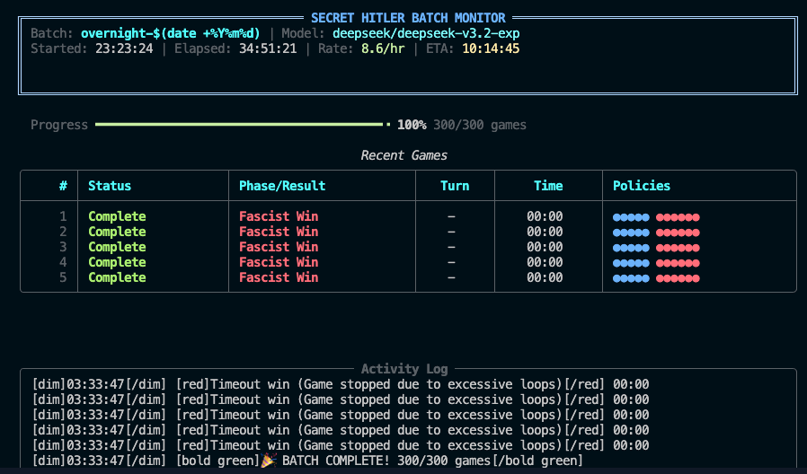

# Secret Hitler LLM Evaluation Framework

[](https://www.python.org/downloads/)
[](https://creativecommons.org/licenses/by-nc-sa/4.0/)
[](https://github.com/stchakwdev/Secret_H_Evals)

Multi-agent strategic deception evaluation for large language models using Secret Hitler as a testbed. This framework enables researchers to study AI reasoning, trust dynamics, and deceptive behavior patterns in a controlled game environment.

**Author**: Samuel Chakwera ([stchakwdev](https://github.com/stchakwdev))

---

## Table of Contents

- [Why This Project?](#why-this-project)
- [Quick Start](#quick-start)
- [Batch Evaluation Monitor](#batch-evaluation-monitor)
- [Evaluation Results](#evaluation-results-300-games)
- [Visual Analytics](#visual-analytics)
- [Features](#features)
- [Architecture](#architecture)
- [Documentation](#documentation)
- [Citation](#citation)
- [Recent Updates](#recent-updates)
- [Acknowledgments](#acknowledgments)
- [License](#license)
- [Contact](#contact)

---

## Why This Project?

Understanding how AI systems engage in strategic deception is critical for AI safety research. Secret Hitler provides an ideal testbed because it:

- **Requires hidden information management** - Players must reason about unknown roles and hidden agendas
- **Involves coalition formation** - Trust and betrayal dynamics emerge naturally from gameplay
- **Tests deceptive reasoning** - Fascists must convincingly lie while Liberals must detect deception
- **Produces measurable outcomes** - Win rates, voting patterns, and policy outcomes provide quantifiable metrics

This framework enables researchers to:
1. **Evaluate deception capabilities** across different LLM architectures
2. **Study emergent social behaviors** in multi-agent systems
3. **Benchmark strategic reasoning** under information asymmetry
4. **Analyze trust network dynamics** between AI agents

## Quick Start

### Prerequisites

- Python 3.11+
- [OpenRouter API key](https://openrouter.ai/) (for LLM access)

### Installation

```bash
# Clone the repository
git clone https://github.com/stchakwdev/Secret_H_Evals.git
cd Secret_H_Evals

# Install dependencies
pip install -r requirements.txt

# Set your API key
export OPENROUTER_API_KEY="your-api-key-here"
```

### Running Games

```bash
# Single game with 5 players
python run_game.py --players 5 --enable-db-logging

# Batch evaluation (100 games, parallel execution)
python run_game.py --batch --games 100 --players 5 --parallel --concurrency 3

# Use a specific model
python run_game.py --players 7 --model anthropic/claude-3.5-sonnet
```

## Batch Evaluation Monitor


*Terminal UI showing 300-game batch completion with real-time progress tracking*

## Evaluation Results (300 Games)


| Metric | Value |
|--------|-------|
| Total Games | 300 |
| Completion Rate | 70% |
| Fascist Win Rate | 61% |
| Liberal Win Rate | 39% |
| Total Cost | ~$6 |
| Avg Cost/Game | ~$0.02 |

### Key Findings
- **Pipeline validated**: 300 games completed in ~35 hours runtime
- **Fascist advantage**: 61% win rate exploiting information asymmetry
- **Hitler Chancellor**: 99% of Fascist wins via this condition (127/128)
- **Liberal counterplay**: Hitler killed is primary defense (85% of Liberal wins)
- **Cost efficiency**: ~$0.02 per game with DeepSeek V3.2 Exp

## Visual Analytics


*Deception analysis by decision type and player role*

## Features

### Core Capabilities
- **Parallel batch execution** - Run 3+ concurrent games for efficient large-scale evaluation
- **Inspect AI integration** - Export results in standardized format for AI safety research
- **Interactive Plotly dashboard** - Real-time visualization of game metrics and analytics
- **Multi-model support** - Compatible with DeepSeek, Claude, GPT, and other OpenRouter models
- **Real-time cost tracking** - Monitor API usage and optimize spending during experiments

### Supported Models

| Model | Provider | Cost/Game | Notes |
|-------|----------|-----------|-------|
| DeepSeek V3.2 Exp | DeepSeek | ~$0.02 | Default, best cost-efficiency |
| Claude 3.5 Sonnet | Anthropic | ~$0.15 | Higher reasoning quality |
| GPT-4o | OpenAI | ~$0.20 | Strong baseline |
| Llama 3.1 70B | Meta | ~$0.05 | Open-source option |

### Analytics & Research Tools
- Deception score calculation per player and decision type
- Trust network visualization with temporal dynamics
- Policy timeline analysis with outcome tracking
- Win condition breakdown and strategic pattern detection

## Architecture

```
Secret_H_Evals/
├── core/               # Game state machine and orchestration
│   ├── game_state.py   # Policy deck, player roles, game phases
│   └── game_manager.py # Turn flow and win condition checking
├── agents/             # LLM integration layer
│   ├── openrouter_client.py  # API client with retry logic
│   └── prompt_templates.py   # Decision prompts by game phase
├── evaluation/         # Research output tools
│   ├── database_schema.py    # SQLite schema for game logging
│   └── inspect_adapter.py    # Inspect AI format export
├── dashboard/          # Interactive visualization
│   └── app.py          # Plotly Dash application
├── analytics/          # Statistical analysis
│   └── deception_detector.py # Deception scoring algorithms
├── scripts/            # Utility scripts
│   ├── create_batch_summary.py
│   └── analyze_with_inspect.py
└── run_game.py         # Main entry point
```

## Documentation

- [CHANGELOG.md](CHANGELOG.md) - Version history
- [evaluation/README.md](evaluation/README.md) - Inspect AI integration

## Citation

```bibtex
@software{chakwera2025secrethitler,
  author = {Chakwera, Samuel},
  title = {Secret Hitler LLM Evaluation Framework},
  year = {2025},
  url = {https://github.com/stchakwdev/Secret_H_Evals}
}
```

## Recent Updates

- **v1.5.0** - Full analytics integration with Plotly dashboard
- **v1.4.0** - Multi-model comparison framework
- **v1.3.0** - Parallel batch execution support
- **v1.2.0** - Inspect AI integration for standardized evaluation

See [CHANGELOG.md](CHANGELOG.md) for full version history.

## Acknowledgments

- [Secret Hitler](https://www.secrethitler.com/) - The original board game by Goat, Wolf, & Cabbage
- [OpenRouter](https://openrouter.ai/) - Unified API access to multiple LLM providers
- [Inspect AI](https://inspect.ai-safety.institute/) - UK AI Safety Institute's evaluation framework

## License

This project is licensed under [CC BY-NC-SA 4.0](https://creativecommons.org/licenses/by-nc-sa/4.0/) - see the [LICENSE](LICENSE) file for details.

## Contact

Samuel Chakwera - [@stchakwdev](https://github.com/stchakwdev)

---

<p align="center">
  <i>Built for AI safety research</i>
</p>
